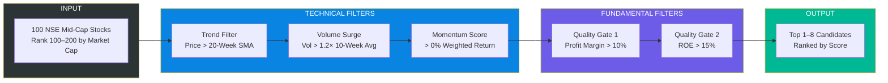
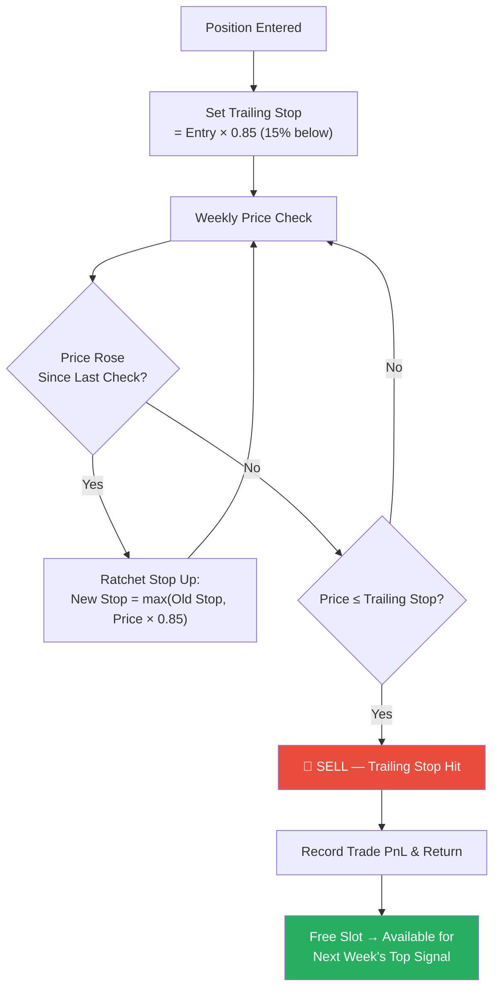

# Stock Investment System v3 — Selection Mechanism

## Overview

A **systematic weekly momentum + quality strategy** for NSE mid-cap stocks (ranked 100–200 by market cap). v3 refines the trend detection and risk management parameters — using a faster 20-week SMA for trend confirmation and a wider 15% trailing stop to reduce whipsaw exits in volatile mid-caps.

---

## System Architecture

```mermaid
flowchart TD
    subgraph WEEKLY["🔄 WEEKLY SCAN (run_weekely.py)"]
        A[Start Weekly Scan] --> B[Get Universe:<br/>NSE Stocks Ranked 100–200<br/>by Market Cap · 100 Stocks]
        B --> C[Build Fundamentals Cache<br/>Fetch Profit Margins + ROE<br/>via yfinance]
        C --> D[Run Scanner on Universe]
    end

    subgraph SCANNER["🔍 SCANNER (scanner.py)"]
        D --> E[Download 1-Year Weekly OHLCV Data]
        E --> F{Has ≥ 30 weeks<br/>of data?}
        F -->|No| REJECT[❌ Reject]
        F -->|Yes| G[Compute Indicators:<br/>• 10-Week Volume SMA<br/>• 20-Week Price SMA]
        G --> H{Filter 1:<br/>Price > 20-Week SMA?}
        H -->|No| REJECT
        H -->|Yes| I{Filter 2:<br/>Volume > 1.2×<br/>10-Week Avg Volume?}
        I -->|No| REJECT
        I -->|Yes| J[Compute Momentum Score:<br/>0.5 × Return_4w<br/>+ 0.3 × Return_8w<br/>+ 0.2 × Return_12w]
        J --> K{Filter 3:<br/>Score > 0?}
        K -->|No| REJECT
        K -->|Yes| L{Filter 4:<br/>Profit Margin > 10%?}
        L -->|No| REJECT
        L -->|Yes| M{Filter 5:<br/>ROE > 15%?}
        M -->|No| REJECT
        M -->|Yes| PASS[✅ Candidate]
    end

    subgraph RANKING["📊 RANKING & SIGNALS"]
        PASS --> N[Sort All Candidates<br/>by Momentum Score ↓]
        N --> O[Save to signals.csv]
    end

    subgraph PORTFOLIO["📁 PORTFOLIO MANAGEMENT"]
        O --> P[Check Existing Positions]
        P --> Q{Current Price ≤<br/>Trailing Stop?}
        Q -->|Yes| R[Generate SELL Action]
        Q -->|No| S[Update Trailing Stop:<br/>max old_stop,<br/>price × 0.85]
        R --> T[Generate BUY Actions<br/>Fill Empty Slots<br/>from Top Signals]
        S --> T
        T --> U[Save actions.csv]
    end

    subgraph EXECUTION["💰 MONDAY EXECUTION (execute_monday.py)"]
        U --> V[Execute SELL Orders First]
        V --> W[Free Up Cash]
        W --> X[Execute BUY Orders]
        X --> Y[Position Size = 12.5% of Equity]
        Y --> Z[Set Initial Trailing Stop<br/>= Entry Price × 0.85]
        Z --> AA[Update Portfolio & Trades CSV]
        AA --> AB[Update Equity History]
    end

    style WEEKLY fill:#1a1a2e,color:#fff
    style SCANNER fill:#16213e,color:#fff
    style RANKING fill:#0f3460,color:#fff
    style PORTFOLIO fill:#533483,color:#fff
    style EXECUTION fill:#e94560,color:#fff
```



---

## Selection Filter Pipeline



---

## Risk Management Flow



---

## Momentum Scoring Formula

$$
\text{Score} = 0.5 \times R_{4w} + 0.3 \times R_{8w} + 0.2 \times R_{12w}
$$

Where $R_{nw}$ = percentage return over the last $n$ weeks.

The weighting emphasizes **recent price acceleration** (50% weight on 1-month return) while still rewarding sustained momentum over the medium term.

---

## Configuration Parameters

| Parameter | Value | Description |
|-----------|-------|-------------|
| `UNIVERSE_START` | 100 | Start rank by market cap |
| `UNIVERSE_END` | 200 | End rank by market cap |
| `MAX_POSITIONS` | 8 | Maximum concurrent holdings |
| `POSITION_SIZE` | 12.5% | Equal-weight allocation per stock |
| `TRAILING_STOP` | **15%** | Trailing stop loss percentage |
| `SCORE_THRESHOLD` | 0% | Minimum momentum score (any positive) |
| `VOLUME_MULTIPLIER` | 1.2× | Volume must exceed this × 10-week average |
| `PROFIT_MARGIN_THRESHOLD` | 10% | Minimum profit margin |
| `ROE_THRESHOLD` | 15% | Minimum Return on Equity |
| `TRANSACTION_COST` | 0.2% | Modeled cost per trade |
| `INITIAL_CAPITAL` | ₹1,00,000 | Starting capital |

---

## Version Evolution (v1 → v2 → v3)

| Aspect | v1 | v2 | v3 | Rationale for v3 |
|--------|----|----|----|----|
| **Universe** | 75 stocks (100–175) | 100 stocks (100–200) | 100 stocks (100–200) | Same wider net as v2 |
| **Trend Filter** | Price > 90% of 8W High | Price > 30-Week SMA | **Price > 20-Week SMA** | Faster trend detection; 30W was too slow to catch early breakouts |
| **Trailing Stop** | 10% | 10% | **15%** | Reduces whipsaw exits; gives mid-caps room to breathe |
| **Score Threshold** | > 8% | > 0% | > 0% | Same as v2 |
| **Margin Threshold** | > 5% | > 10% | > 10% | Same as v2 |
| **ROE Filter** | None | > 15% | > 15% | Same as v2 |

### Key v3 Changes Explained

**1. Trend Filter: 30-Week → 20-Week SMA**
- The 30-week SMA in v2 was a very long-term filter that could miss stocks in early-stage breakouts
- 20-week SMA is the ~100-day moving average equivalent — a widely-followed institutional trend line
- More responsive: catches uptrends earlier while still filtering out downtrending stocks

**2. Trailing Stop: 10% → 15%**
- Indian mid-caps routinely exhibit 10–12% intra-trend drawdowns
- At 10%, positions were getting stopped out prematurely during normal volatility
- 15% gives the position room to absorb typical noise while still protecting against genuine reversals
- This single change should materially reduce unnecessary churn and improve hold duration

---

## Current Live Performance

**Started**: June 9, 2026 | **Capital**: ₹1,00,000

| Date | Total Equity | Return |
|------|-------------|--------|
| Jun 9 | ₹99,787 | -0.2% |
| Jun 15 | ₹99,290 | -0.7% |
| Jun 19 | ₹1,00,375 | +0.4% |
| Jun 22 | ₹1,00,412 | +0.4% |

**Current Portfolio** (8/8 slots filled):

| Stock | Entry Date | Entry Price | Current Return |
|-------|-----------|-------------|----------------|
| LAURUSLABS | Jun 9 | ₹1,438.50 | +7.2% ✅ |
| MOTILALOFS | Jun 16 | ₹940.45 | +3.0% ✅ |
| INDHOTEL | Jun 16 | ₹689.75 | +5.6% ✅ |
| MAHABANK | Jun 16 | ₹89.20 | -0.6% ⚠️ |
| IOB | Jun 23 | ₹35.09 | -2.1% ⚠️ |
| SUZLON | Jun 23 | ₹59.34 | -4.2% ⚠️ |
| ICICIGI | Jun 23 | ₹1,869.40 | -5.0% ❌ |
| NMDC | Jun 9 | ₹90.77 | -5.9% ❌ |

> Note: With the 15% trailing stop, none of these losers have hit their stops yet — they have room to recover, unlike v1/v2 where the 10% stop would have already triggered on NMDC and ICICIGI.

---

## Project Structure

```
v3/
├── config.py                  # All strategy parameters
├── run_weekely.py             # Weekly orchestrator (scan + signal + actions)
├── execute_monday.py          # Monday execution (fills orders + equity track)
├── update_portfolio.py        # Manual portfolio refresh
├── rebuild_equity_history.py  # Rebuild equity CSV from scratch
│
├── strategy/
│   ├── universe.py            # Fetch NSE mid-cap universe via yfinance screen
│   ├── fundamentals.py        # Cache profit margins & ROE
│   ├── scanner.py             # Core selection engine (filters + scoring)
│   ├── portfolio_manager.py   # Position tracking, trailing stops, buy/sell gen
│   ├── execution.py           # Order execution & trade recording
│   ├── equity_tracker.py      # Daily equity curve updates (hardened)
│   └── system_state.py        # Duplicate-run prevention
│
├── data/
│   ├── portfolio.csv          # Current holdings
│   ├── capital.csv            # Available cash
│   ├── signals.csv            # Latest scan candidates
│   ├── actions.csv            # Pending buy/sell orders
│   ├── trades.csv             # Closed trade history
│   ├── equity_history.csv     # Daily equity curve
│   ├── fundamentals_cache.csv # Cached margin + ROE data
│   └── system_state.csv       # Week-processed flag
│
└── reports/
    └── live_stats.py          # Portfolio statistics & reporting
```

---

## How to Run

```bash
# 1. Weekly scan (run any weekday)
python run_weekely.py

# 2. Execute orders (run Monday)
python execute_monday.py

# 3. Update equity history manually
python update_portfolio.py
```

---

## Strategy Logic Summary

1. **Universe**: Top 100–200 NSE stocks by market cap (mid-cap sweet spot)
2. **Trend**: Only buy stocks trading above their **20-week moving average**
3. **Volume**: Require 20%+ volume surge vs. 10-week average (institutional confirmation)
4. **Momentum**: Recency-weighted return must be positive
5. **Quality**: Profit margin > 10% AND ROE > 15% (profitable, capital-efficient businesses)
6. **Sizing**: Equal-weight 12.5% per position, max 8 positions
7. **Exit**: **15% trailing stop** — ratchets up, never down; gives positions room to breathe
